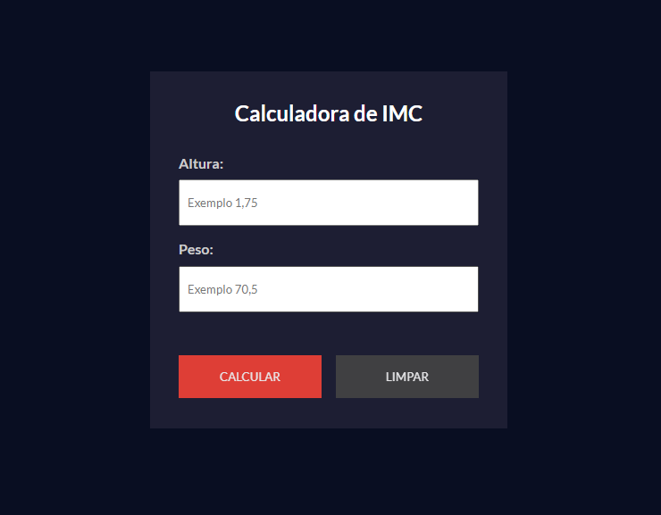

# Calculadora IMC.

> Projeto calculadora IMC (Índice de Massa Corporal).

Esse projeto é uma calculadora de IMC desenvolvida com as tecnologias JavaScript, HTML e CSS.

A classificação do índice de massa corporal (IMC) pode ajudar a identificar problemas de obesidade ou desnutrição, em crianças, adolescentes, adultos e idosos.

Tela inicial:

Resultado IMC normal:

Resultado IMC muito magro:

Resultado IMC sobrepeso:

Resultado IMC obesidade:

Resultado IMC obesidade grave:

## Tecnologias
- JavaScript
- HTML
- CSS
- Git e GitHub